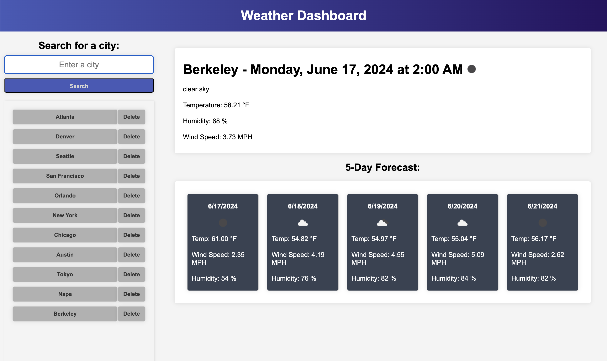

# Weather Dashboard

This is a simple web application that allows users to check the current weather and forecast for multiple cities. It uses the OpenWeatherMap API to fetch weather data.

- Motivation

The motivation behind this project was to create a user-friendly tool that provides accurate and up-to-date weather information. This application aims to help users plan their activities based on the current weather and forecast of their chosen city.

- Why This Was Built

This application was built to provide a practical solution for those who need quick and reliable weather updates. It was also built as a way to explore and understand how to work with APIs, specifically the OpenWeatherMap API.

- What It Solved

This application solves the problem of having to search through multiple sources to get comprehensive weather data. It provides current weather conditions and a 5-day forecast all in one place, making it a convenient tool for users.

- What I Learned

Through this project, I gained a deeper understanding of how to use APIs in web development. I also learned how to manipulate the DOM using JavaScript and how to style a web application using CSS.

## Table of Contents

- [Features](#installation)
- [How to Use](#how-to-use)
- [Usage](#usage)
- [Technologies Used](#technologies-used)
- [Local Development](#local-development)
- [Deployment Link](#deployment-link)
- [Credits & Resources](#credits--resources)
- [Lisence](#license)

## Features

- Search for a city and view its current weather conditions.
- View a 5-day forecast for the searched city.
- Search history for easy access to previously searched cities.

## How to Use

1. Enter a city name in the search box and click the "Search" button.
2. The current weather for that city will be displayed, along with a 5-day forecast.
3. Your search will be saved in the search history. You can click on a city in the search history to view its weather again.

## Usage

## Technologies Used

- HTML
- CSS
- JavaScript
- OpenWeatherMap API

## Local Development

To set up this project locally for development:

1. Clone this repository.
2. Open `index.html` in your browser.

## Deployment Link

[Click here to go to the deployed site](https://geoschu.github.io/weather-dashboard/)

## Credits & Resources

[OpenWeatherMap API](https://openweathermap.org/api)
[OpenWeatherMap API guide](https://openweathermap.org/guide)
[Units in API response](https://openweathermap.org/weather-data)

## License

This project is open source and available under the [ISC License](LICENSE).
